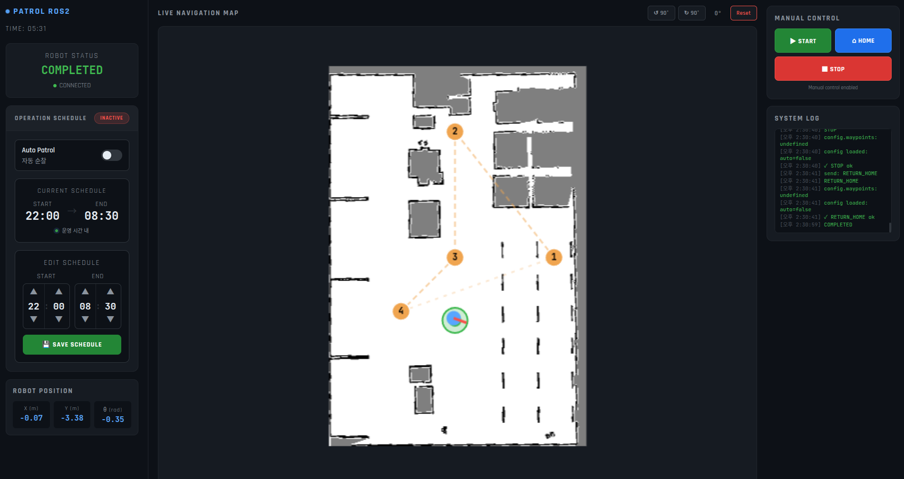

# ROS2 기반 자율 순찰 로봇 시스템

ROS2 Humble + Nav2 + Gazebo 시뮬레이션 환경에서 TurtleBot3를 활용한 자율 순찰 로봇 시스템
웹 대시보드를 통해 로봇을 실시간 모니터링하고 원격 제어할 수 있습니다.

---

## 프로젝트 개요

| 항목 | 내용 |
|------|------|
| 플랫폼 | TurtleBot3 (Gazebo 시뮬레이션) |
| ROS 버전 | ROS2 Humble |
| 네비게이션 | Nav2 + AMCL |
| 웹 서버 | FastAPI + WebSocket |
| 환경 | Ubuntu 22.04, Docker, Python3 |

---

## 대시보드 

<p align="center">
  <video src="시연영상.webm" width="100%" height="auto" controls autoplay loop muted>
    시연영상
  </video>
</p>

### 주요 기능
- **Live Navigation Map**: 실시간 지도 + waypoint(4개) + 로봇 위치 표시
- **Robot Status**: 로봇 상태 실시간 모니터링 (IDLE / START_PATROL / RETURN_HOME / STOP / CANCELLED / COMPLETED /FAILED)
- **Operation Schedule**: 자동 순찰 스케줄 설정 (시작/종료 시간)
- **Patrol Mode Control**: 자동 순찰 모드 활성화 스위치. 활성화 시 수동 제어부 잠금(Lock) 처리
- **Manual Control**: START / HOME / STOP 원격 제어
- **Robot Position**: X, Y, θ 실시간 좌표 표시
- **System Log**: 실시간 로그 스트리밍

---

## 시스템 구조

```
[ Web Dashboard ]
        ↕ WebSocket / HTTP
[ web_node (ROS2) ]
        ↕ Topic / Parameter
[ control_node ]  ←→  [ executor_node ]
                              ↕ Action
                        [ Nav2 Stack ]
                              ↕
                    [ TurtleBot3 (Gazebo) ]
```

### 노드 설명

| 노드 | 역할 |
|------|------|
| **web_node** | 웹 대시보드와 ROS2 간 인터페이스. WebSocket으로 실시간 상태 푸시 |
| **control_node** | 운영 정책 판단, 상태 관리, Executor에 명령 전달 |
| **executor_node** | Nav2 Action Client로 목표 좌표 전송 및 네비게이션 실행 |

### Executor 상태 정의
# RobotState
- IDLE            : 대기 상태
- START_PATROL    : 순찰 시작
- RETURN_HOME     : 홈 복귀 중
- STOP            : 정지 요청
- CANCELLED       : 취소 완료
- COMPLETED       : 임무 완료
- FAILED          : 주행 실패

# TaskResult (Nav2 결과)
- SUCCEEDED       : 주행 성공
- FAILED          : 주행 실패
- CANCELLED       : 주행 취소
---

## 파일 구조

```
/root/
└── patrol_robot/
    └── src/
        ├── patrol_control/
        │   └── config/
        │       └── operation_policy.yaml
        └── web_server/
            ├── app.py
            ├── ros_node.py
            ├── websocket_manager.py
            └── templates/
                └── index.html
```

---

## 실행 방법

### 1. Gazebo 시뮬레이션 환경 실행
```bash
ros2 launch patrol_control small_warehouse_tb3.launch.py
```

### 2. Nav2 네비게이션 스택 실행
```bash
ros2 launch patrol_control bringup_launch.py slam:=False use_sim_time:=True
```

### 3. 제어 노드 실행
```bash
ros2 run patrol_control control_node
ros2 run patrol_control executor_node
```

### 4. 웹 서버 실행
```bash
cd /root/patrol_robot/src/web_server && python3 app.py
```

---

## 트러블슈팅

### 1. 파라미터 콜백 내 데이터 동기화 이슈

**문제**  
`add_on_set_parameters_callback` 내에서 `get_parameter()`를 호출하면, 파라미터가 아직 커밋(Commit)되기 전 상태라 이전 값을 반환하는 문제 발생.  
웹 대시보드에서 config 변경 시 control_node에 실시간 반영이 안 됨.

**해결**  
콜백으로 전달된 `Parameter` 객체 리스트를 `hasattr` + `setattr`로 직접 파싱하여 즉시 반영.

```python
def on_param_change(self, params):
    """웹서버에서 set_parameters 호출 시 자동 실행"""
    for p in params:
        self.get_logger().info(f'[Param 변경] {p.name} = {p.value}')
        if hasattr(self, p.name):
            setattr(self, p.name, p.value)
    return SetParametersResult(successful=True)
```

---

### 2. WebSocket 선택 이유

실시간 로봇 상태와 지도를 웹에서 표시하기 위해 HTTP 폴링 대신 WebSocket을 사용했다.  
HTTP는 클라이언트가 주기적으로 요청해야 하지만, WebSocket은 서버에서 상태 변화가 생길 때 즉시 푸시할 수 있어 실시간성이 필요한 로봇 모니터링에 적합했다.

---

### 3. Nav2 시간 동기화 문제 (use_sim_time)

**문제**  
Gazebo 가상 시간과 실제 시스템 시간 불일치로 TF(좌표 변환) 통신 오류 발생.

**해결**  
모든 관련 노드의 `use_sim_time` 파라미터를 `True`로 통일.

```bash
ros2 launch patrol_control bringup_launch.py slam:=False use_sim_time:=True
```

---

### 4. AMCL 초기 위치 설정 문제

**문제**  
AMCL 기반 Localization은 초기 위치 정보가 없으면 위치 추정을 시작하지 못함.

**해결**  
- RViz의 `2D Pose Estimate` 툴로 초기 위치 수동 설정
- YAML 파일의 `amcl` 섹션에 시작 좌표 직접 입력

---

## 사용 기술

| 분류 | 기술 |
|------|------|
| 로봇 미들웨어 | ROS2 Humble |
| 네비게이션 | Nav2, AMCL |
| 시뮬레이션 | Gazebo, TurtleBot3 |
| 웹 서버 | FastAPI, WebSocket |
| 언어 | Python3 |
| 환경 | Ubuntu 22.04, Docker, Git |

---

## 관련 학습 기록

- [Velog - ROS2 및 C++ 학습 정리](https://velog.io/@kkkgim)